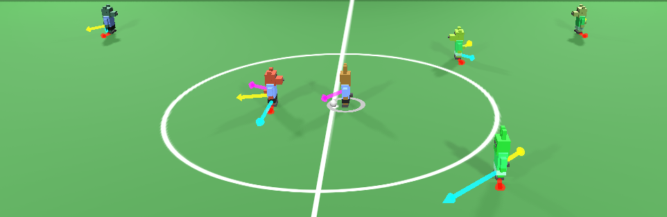

# Display Vector3D 

[](https://godotengine.org/)
[](LICENSE)


A lightweight Godot 4.x addon to visualize 3D vectors directly in the editor or during runtime.
Perfect for debugging player movement, AI steering, or physics directions.



# ✨ Features

Draws vector lines (arrows) in 3D space

Customizable color, length, and thickness

Works in both editor and runtime

Minimal performance overhead

Easy to toggle on/off for debug builds

# 📦 Installation

Copy the `display_vector3d/` folder into your project’s `res://addons/` directory

In Godot, go to Project → Project Settings → Plugins

Enable Display Vector3D

# ⚙️ Usage

Once enabled, you can use it directly in your scripts.

Example:

```
var velocity = Vector3(1, 0, 2)
DisplayVector3D.draw_vector(global_position, velocity.normalized() * 2, Color(0, 1, 0))
```

